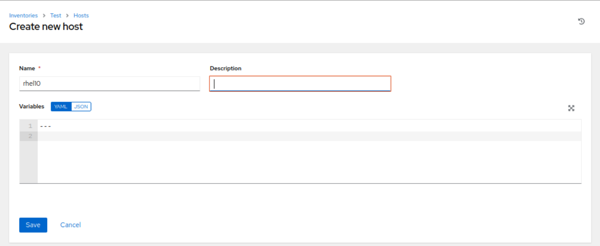

# Objectives

1. [Create and restrict an inventory](#create-and-restrict-an-inventory-to-an-automation-controller-user) to an [automation controller](#automation-controllers) user
2. [Restrict a credential and/or a project to an automation controller user](#restrict-a-credential-andor-a-project-to-an-automation-controller-user)
3. [Be able to create and launch a template as an automation controller user](#be-able-to-create-and-launch-a-template-as-an-automation-controller-user)

## Automation Controllers

- Ansible Tower
    - Web-based interface for ansible
    - Additoinal features over command line version
        1. RBAC 
            - Users
                - System Administrator -> Read/Write access to entire Tower
                - System Auditor -> Read-Only access to entire Tower
                - Normal user -> Start with minimal access, add roles after creation
            - Teams
                - Group of user
            - Roles
                - Organizational Admin
                - Project Admin
                - Inventory Admin
                - Credential Admin
                - Notification Admin
                - Workflow Admin
                - Job Template Admin
                - Auditor
                - Member
                - Read
                - Execute
        2. Caching of passwords
        3. Workflow designer
    - Evaluation license available from Red Hat

- Ansible Web eXecutable (AWX) is the open source equivalent of Ansible Tower
    - Installation is rather complicated
    - Advisible to use container based installation

- [Ansible Automation Platform](https://console.redhat.com)
    - Ansible engine
    - Ansible Tower
    - Content Collections
    - Automation Hub
    - Automation Analytics

## Red Hat Interactive Lab
- [Red Hat Ansible Automation Platform learning hub](https://www.redhat.com/en/technologies/management/ansible/learn)
- [Experience self-paced, interactive, hands-on labs with Ansible Automation Platform](https://www.redhat.com/en/engage/levelup-ansible-selfpaced-20230112). 
  - This lab gives a good overview of Ansible Automation Platform and creating and launching templates:
    - Introduction to Ansible automation controller - AAP 2.5 
- [Getting started with Red Hat Ansible Automation Platform](https://cloud.redhat.com/learn/getting-started-red-hat-ansible-automation-platform?extIdCarryOver=true&sc_cid=RHCTA0250000447325)

## Installing Ansible Automation Platform
- Refer to the documentation for [Red Hat Ansible Automation Platform 2.5](https://docs.redhat.com/en/documentation/red_hat_ansible_automation_platform/2.5)

- [Containerized Installation](https://docs.redhat.com/en/documentation/red_hat_ansible_automation_platform/2.5/html/containerized_installation/index)

## Revision Setup
For my revision, I have set up AWX on containers for practice.  We first setup AWX and login:

Users are found under `Access` group in the side panel. Adding user is straightforward by clicking on `Add` button:

Specify the user details and type and click `Save` to add:

## Create and restrict an inventory to an automation controller user

Inventories are found under `Resources` group in the side panel.  Click on `Add -> Add inventory` to create new inventories:

To create new inventory, first give it a name and save:

After saving your inventory, you can then add hosts in this inventory:

Specify host details to complete adding host to the inventory:

To specify / restrict an inventory to an automation controller user, click on the `Access` tab of that inventory.  Here you can see that the user `admin` has `System Administrator` role access to the inventory:

To add a user, first click on `Add` and choose whether you want to add `Users` or a `Teams`. In our case we want `Users`:

Next we choose the user from the list. We will select the user `test` which we have created earlier:

Next we select the authorization for the user. For this example, the user is allowed to use the inventory:

The setup for the user access to inventory is now complete:

Logout and relogin as the `test` user to verify access:

As the `test` user, notice that only 1 inventory is visible:

As the `test` user, notice also that only read access is available:

## Restrict a credential and/or a project to an automation controller user
Restricting access to a `credential` or a `project` works the same way as restricting access to inventories. As the admin user, we shall restrict the access so that the `test` user can only access `Demo Project`. 

Existing `Projects` can be found under `Resources` group in the left panel:

To grant or revoke user access, click on the project and the corresponding `Access` tab. Notice that only `admin` user has access currently:

In our example, we will grant the user `test` access to our `Demo Project`. Similar to the case of `Inventory`, you first select the resource type, `Users` or `Teams`, then you will select the items from the resource type, after which you choose the access to grant. We will grant the user `test` to `Use` the `Demo Project`:

Verify by logging in as the `test` user. You will find that you are restricted to a single project, `Demo Project`:

Notice also that you are restructed to read only access, as can be seen by the greyed out `Delete` icon.  

For credentials, it is configured the same way. The roles are as follow:

## Be able to create and launch a template as an automation controller user
`Projects` are a collection of playbooks. `Template` is job associated with a single playbook in the project. To be able to create the template, the required access to the project must be granted. 

For job templates, these are the roles:

Job templates are managed under `Access` tab similar to `credentials` and `projects`. To successfully launch the template, ensure that you have access to the required credentials and that the credentials is setup properly in the job template. 